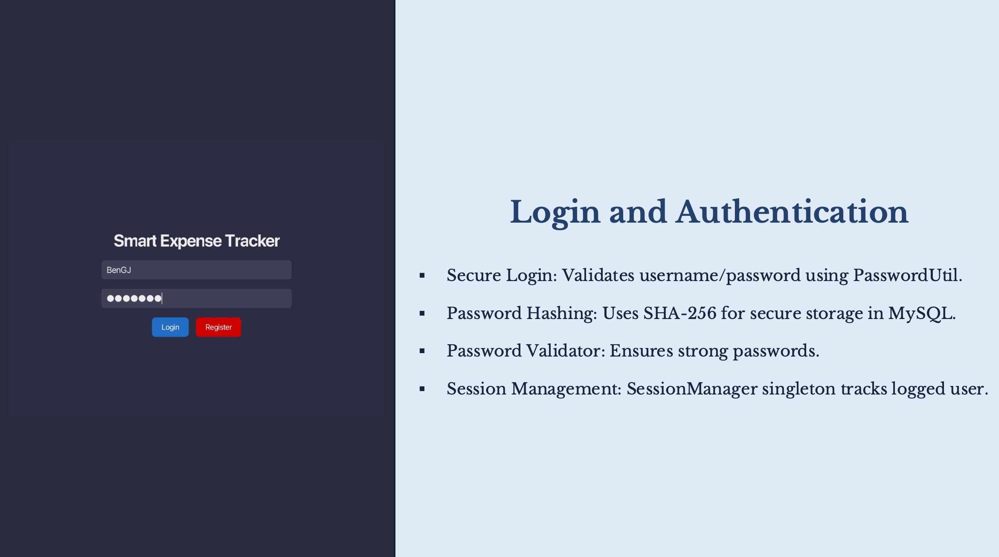
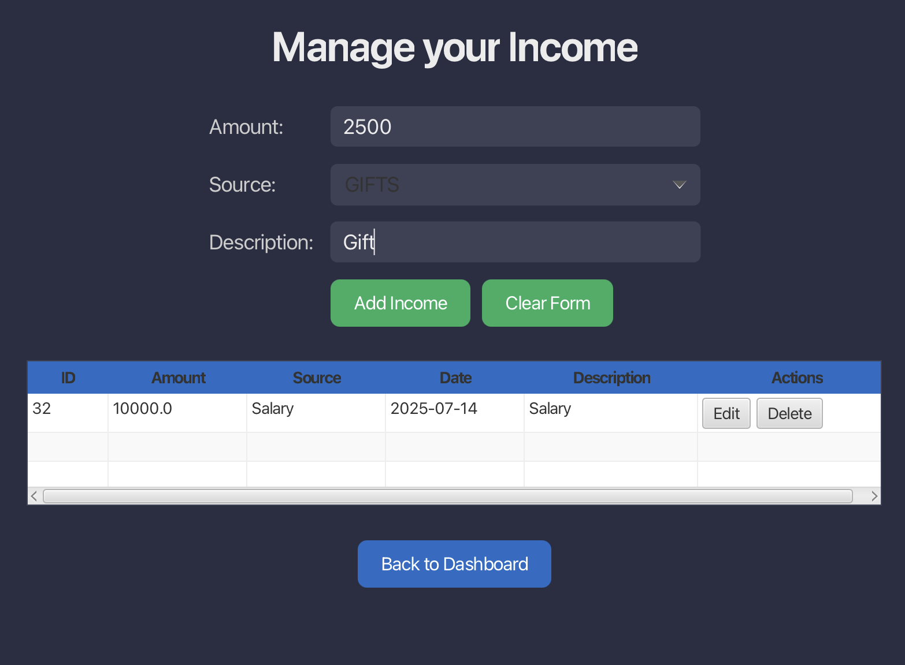
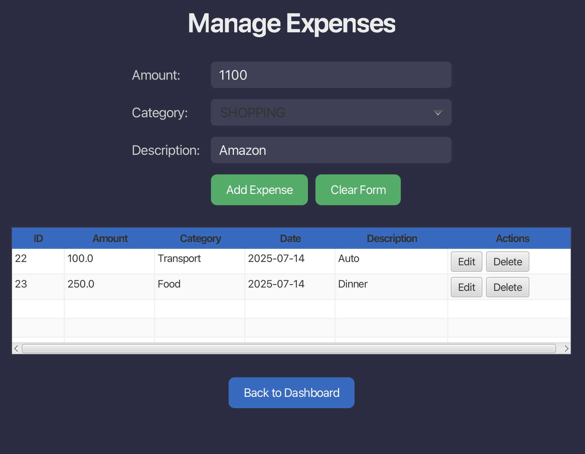
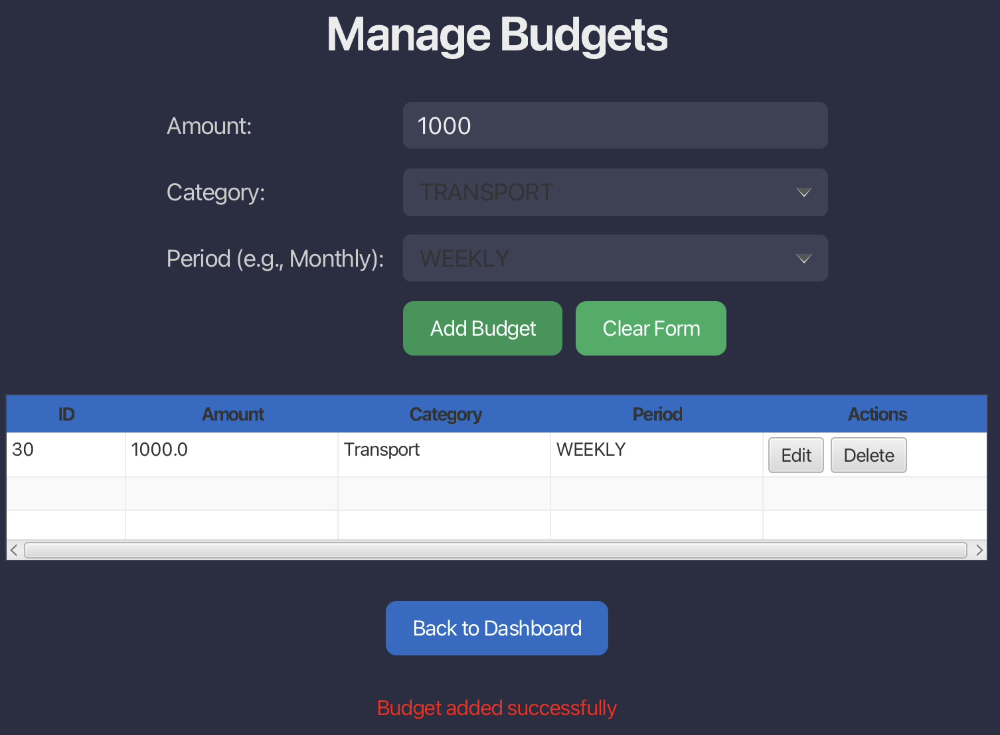
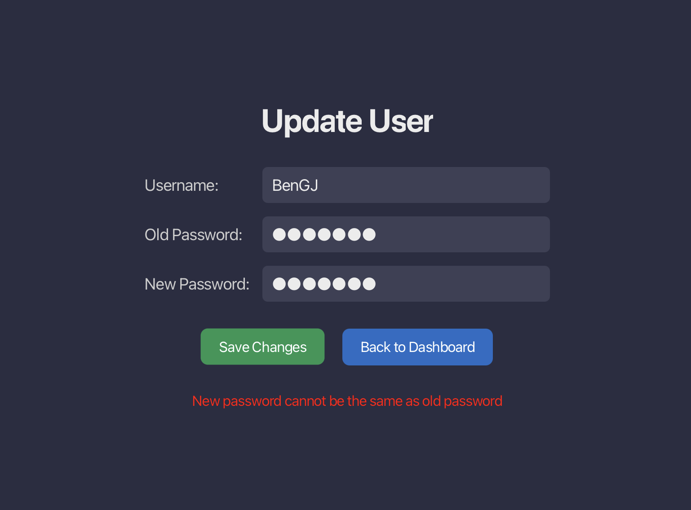
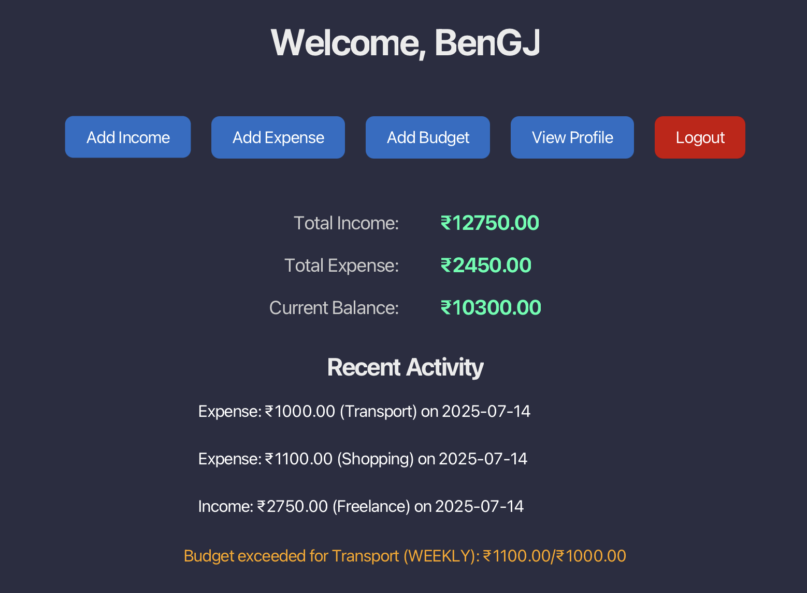

# Smart Expense Tracker

## Project Overview

Smart Expense Tracker is a desktop application designed to help users manage personal finances by tracking income, expenses, and budgets. Built as part of a university course project, it provides a user-friendly interface for authenticated users to record financial transactions, edit records, view summaries, monitor recent activity, and receive budget alerts. The application ensures data integrity through robust validation, secure user authentication, and persistent storage in a MySQL database. All core features, including user management, transaction tracking, budget management, and alerts, are fully implemented, with a polished dark-themed UI.

## Features

### Implemented Features
- **User Authentication**:
    - Login system with username and password validation.
    - Passwords are masked (displayed as `****`) in the profile view for security.
    - Session management to track logged-in users across application pages.
- **Dashboard**:
    - Displays a welcome message with the logged-in user’s username.
    - Shows financial summaries: total income, total expenses, and current balance.
    - Lists up to three recent transactions (mixed income and expense records) with details like amount, category/source, and date.
    - Displays budget alerts for categories where expenses exceed set budgets.
- **Income Management**:
    - Add, edit, and delete income records with amount, source (selected via dropdown from `IncomeSource` enum), and description.
    - View all incomes in a table with columns for ID, amount, source, date, description, and action buttons (Edit/Delete).
    - Real-time table updates after adding, editing, or deleting records.
- **Expense Management**:
    - Add, edit, and delete expenses with amount, category (selected via dropdown from `ExpenseCategory` enum), and description.
    - View all expenses in a table with columns for ID, amount, category, date, description, and action buttons.
    - Real-time table updates after modifications.
- **Budget Management**:
    - Add, edit, and delete budgets with amount, category (via `ExpenseCategory` enum), and period (Weekly/Monthly via `BudgetPeriod` enum).
    - View all budgets in a table with columns for ID, amount, category, period, and action buttons.
    - Real-time table updates after modifications.
- **Budget Alerts**:
    - Real-time notifications on the dashboard when expenses exceed budget limits for a category (e.g., “Budget exceeded for Food (MONTHLY): ₹8,000/₹5,000”).
- **Profile Management**:
    - View and update user details (username and password) with validation.
    - Secure password input using a password field.
- **Logging**:
    - Comprehensive logging of user actions (e.g., login, adding/editing/deleting transactions) and errors to `logs.log` using a custom logger.
- **UI Design**:
    - Dark-themed interface with consistent styling (Roboto font, `#2B2D42` background, `#206dc5` buttons).
    - Responsive layout with tables, forms, dropdowns, and navigation buttons across all pages.
    - Error messages displayed in the UI for user feedback.
    - Clear form buttons to reset input fields.

### Planned Features
- **Data Visualization**:
    - Charts (e.g., pie chart for expense categories, line chart for spending trends).
- **User Settings**:
    - Configurable currency (currently fixed to `₹`).
    - Theme toggling (dark/light modes).
- **Enhanced Validation**:
    - Disable action buttons when form fields are empty.
    - Confirmation dialogs for delete actions.
- **Reporting**:
    - Export financial summaries as PDF or CSV.

## Technologies

- **Java 21**: Core programming language for application logic.
- **JavaFX**: Framework for building the graphical user interface.
- **JDBC**: Database connectivity for MySQL integration.
- **MySQL**: Relational database for persistent storage of users, incomes, expenses, and budgets.
- **Maven**: Build tool for dependency management and project configuration.
- **Custom Logger**: Logs actions and errors to `logs/` for debugging and auditing.

## Project Structure

```
Smart-Expense-Tracker/
├── src/
│   ├── main/
│   │   ├── java/com/bengregory/expensetracker/
│   │   │   ├── controller/
│   │   │   │   ├── DashboardController.java
│   │   │   │   ├── AddBudgetController.java
│   │   │   │   ├── AddIncomeController.java
│   │   │   │   ├── AddExpenseController.java
│   │   │   │   ├── ProfileController.java
│   │   │   │   ├── LoginController.java
│   │   │   │   ├── RegisterController.java
│   │   │   ├── dao/
│   │   │   │   ├── UserDAO.java
│   │   │   │   ├── IncomeDAO.java
│   │   │   │   ├── ExpenseDAO.java
│   │   │   │   ├── BudgetDAO.java
│   │   │   ├── model/
│   │   │   │   ├── User.java
│   │   │   │   ├── Income.java
│   │   │   │   ├── Expense.java
│   │   │   │   ├── Budget.java
│   │   │   ├── service/
│   │   │   │   ├── UserService.java
│   │   │   │   ├── IncomeService.java
│   │   │   │   ├── ExpenseService.java
│   │   │   │   ├── BudgetService.java
│   │   │   ├── util/
│   │   │   │   ├── CustomLogger.java
│   │   │   │   ├── DatabaseConnection.java
│   │   │   │   ├── SessionManager.java
│   │   │   │   ├── PasswordUtil.java
│   │   │   │   ├── ValidationUtil.java
│   │   │   │   ├── InvalidInputException.java
│   │   │   │   ├── DatabaseException.java
│   │   ├── resources/com/bengregory/expensetracker/view/
│   │   │   ├── dashboard.fxml
│   │   │   ├── add_income.fxml
│   │   │   ├── add_expense.fxml
│   │   │   ├── add_budget.fxml
│   │   │   ├── profile.fxml
│   │   │   ├── login.fxml
│   │   │   ├── register.fxml
│   │   │   ├── styles.css
│   ├── test/
│   │   ├── java/com/bengregory/expensetracker/
│   │   │   ├── dao/
│   │   │   │   ├── UserDAOTest.java
│   │   │   │   ├── IncomeDAOTest.java
│   │   │   │   ├── ExpenseDAOTest.java
│   │   │   │   ├── BudgetDAOTest.java
│   │   │   ├── util/
│   │   │   │   ├── DatabaseConnectionTest.java
├── pom.xml
├── README.md
```

## Setup Instructions

1. **Prerequisites**:
    - Java 21 JDK
    - MySQL Server
    - Maven
    - IDE (e.g., IntelliJ IDEA, Eclipse)
    - Scene Builder (for editing FXML files)

2. **Clone Repository**:
   ```bash
   git clone https://github.com/BenGJ10/Smart-Expense-Tracker.git
   cd Smart-Expense-Tracker
   ```

3. **Database Setup**:
    - Start MySQL server (e.g., `brew services start mysql` on macOS).
    - Create a database named `expense_tracker_db`.
    - Execute the following SQL to create tables:
      ```sql
      CREATE TABLE users (
          id INT AUTO_INCREMENT PRIMARY KEY,
          username VARCHAR(50) NOT NULL UNIQUE,
          password VARCHAR(255) NOT NULL
      );
 
      CREATE TABLE incomes (
          id INT AUTO_INCREMENT PRIMARY KEY,
          user_id INT,
          amount DOUBLE NOT NULL,
          source VARCHAR(50) NOT NULL,
          date DATETIME NOT NULL,
          description VARCHAR(255),
          FOREIGN KEY (user_id) REFERENCES users(id)
      );
 
      CREATE TABLE expenses (
          id INT AUTO_INCREMENT PRIMARY KEY,
          user_id INT,
          amount DOUBLE NOT NULL,
          category VARCHAR(50) NOT NULL,
          date DATETIME NOT NULL,
          description VARCHAR(255),
          FOREIGN KEY (user_id) REFERENCES users(id)
      );
 
      CREATE TABLE budgets (
          id INT AUTO_INCREMENT PRIMARY KEY,
          user_id INT,
          category VARCHAR(50) NOT NULL,
          amount DOUBLE NOT NULL,
          period VARCHAR(20) NOT NULL,
          date DATE NOT NULL,
          FOREIGN KEY (user_id) REFERENCES users(id)
      );
      ```

4. **Configure Database**:
    - Create `db.properties` in `src/main/resources/` with MySQL credentials:
      ```properties
      db.url=jdbc:mysql://localhost:3306/expense_tracker_db
      db.username=your_username
      db.password=your_password
      ```

5. **Build and Run**:
   ```bash
   mvn clean install
   mvn javafx:run
   ```

6. **Usage**:
    - Register a new user or log in with an existing username and password.
    - Navigate to the dashboard to view financial summaries, recent transactions, and budget alerts.
    - Use “Add Income,” “Add Expense,” or “Add Budget” to manage records with dropdowns for sources, categories, and periods.
    - Edit or delete records directly from tables using action buttons.
    - View or update user details in the profile page.
    - Check budget alerts on the dashboard for overspending.
    - Review `logs.log` for action and error logs.

## Screenshots

Below are screenshots showcasing the application’s key interfaces. All pages feature a dark-themed UI with consistent styling and real-time updates.

- **Login Screen**: User authentication interface.  
  
- **Dashboard**: Displays financial summaries, recent transactions, and budget alerts.  
  
- **Add Income**: Form and table for managing income records with edit/delete functionality.  
  
- **Add Expense**: Form and table for managing expense records with edit/delete functionality.  
  
- **Add Budget**: Form and table for managing budgets with edit/delete functionality.  
  
- **Profile**: View and update user details securely.  
  
- **Dashboard with Budgets**: Updated dashboard with budget alerts.
- 

## Current Status

- **Fully Implemented**:
    - User authentication, session management, and profile updates.
    - Income, expense, and budget management with add, edit, and delete functionality.
    - Real-time table updates in all management screens.
    - Dashboard with financial summaries, recent transactions, and budget alerts.
    - Robust error handling, input validation, and logging.
    - Dark-themed, responsive UI with dropdowns for enums (`IncomeSource`, `ExpenseCategory`, `BudgetPeriod`).
- **Demo Video**: Available at `docs/demo.mp4`, showcasing the application and code walkthrough.
- **Testing**: Basic unit tests for DAOs (`UserDAOTest`, `IncomeDAOTest`, `ExpenseDAOTest`, `BudgetDAOTest`).
- **Documentation**: Updated README with setup, usage, and screenshots.

### Next Steps
- Add data visualization (charts for expense categories and trends).
- Implement user settings for currency and theme selection.
- Enhance UI with validation (disable buttons for empty fields) and delete confirmation dialogs.
- Develop export functionality for financial reports.
- Expand unit tests for controllers and services.
- Write a detailed user guide and project report for submission.

## Contributing

This project is developed as part of a university course. Contributions are not open, but feedback is welcome via the repository’s issues section at [https://github.com/BenGJ10/Smart-Expense-Tracker](https://github.com/BenGJ10/Smart-Expense-Tracker).

## Contributers

- `Ben Gregory John` [GitHub](https://github.com/BenGJ10) | [LinkedIn](https://www.linkedin.com/in/bengj10/)


- `Jerome Philip John` [GitHub](https://github.com/jerome784) | [LinkedIn](https://www.linkedin.com/in/jerome-john-8b7ab8288/)


- `Md Aquib Raza` [GitHub](https://github.com/Razaaquib99)
## License

This project is for educational purposes and not distributed under a specific license.